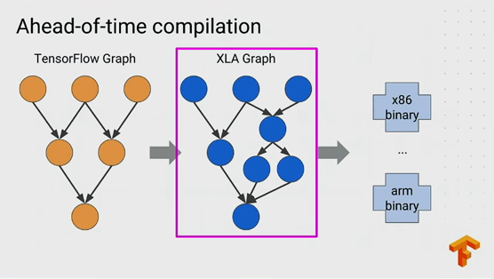

# XLA_AOT
## AOT introduction

In computer science, ahead-of-time (AOT) compilation is the act of compiling a higher-level programming language such as C or C++, or an intermediate representation such as Java bytecode or .NET Framework Common Intermediate Language (CIL) code, into a native (system-dependent) machine code so that the resulting binary file can execute natively.

AOT produces machine optimized code, just like a standard native compiler. The difference is that AOT transforms the bytecode of an extant virtual machine (VM) into machine code.

## XLA AOT



### tfcompile

tfcompile is a standalone tool that ahead-of-time (AOT) compiles TensorFlow graphs into executable code. It can reduce total binary size, and also avoid some runtime overheads. A typical use-case of tfcompile is to compile an inference graph into executable code for mobile devices.

### how does tfcompile work

The TensorFlow graph is normally executed by the TensorFlow runtime. This incurs some runtime overhead for execution of each node in the graph. This also leads to a larger total binary size, since the code for the TensorFlow runtime needs to be available, in addition to the graph itself. The executable code produced by tfcompile does not use the TensorFlow runtime, and only has dependencies on kernels that are actually used in the computation.

The compiler is built on top of the XLA framework. The code bridging TensorFlow to the XLA framework resides under tensorflow/compiler, which also includes support for just-in-time (JIT) compilation of TensorFlow graphs.

### what does tfcompile do

tfcompile takes a `subgraph`, identified by the TensorFlow concepts of `feeds` and `fetches`, and generates a `function` that implements that subgraph. The feeds are the input arguments for the function, and the fetches are the output arguments for the function. All inputs must be fully specified by the feeds; the resulting pruned subgraph cannot contain Placeholder or Variable nodes. It is common to specify all Placeholders and Variables as feeds, which ensures the resulting subgraph no longer contains these nodes. The generated function is packaged as a `cc_library`, with a header file exporting the function signature, and an object file containing the implementation. The user writes code to invoke the generated function as appropriate.

### strengh of tfcompile

It can reduce total binary size, and also avoid some runtime overheads. A typical use-case of tfcompile is to compile an inference graph into executable code for mobile devices.


## Using XLA AOT


This section details high level steps for generating an executable binary with tfcompile from a TensorFlow subgraph. The steps are:

* Step 1: Configure the subgraph to compile
* Step 2: Use the tf_library build macro to compile the subgraph
* Step 3: Write code to invoke the subgraph
* Step 4: Create the final binary

## An example of AOT

### proto

```protobuf
# Each feed is a positional input argument for the generated function.  The order
# of each entry matches the order of each input argument.  Here “x_hold” and “y_hold”
# refer to the names of placeholder nodes defined in the graph.
feed {
  id { node_name: "x_hold" }
  shape {
    dim { size: 2 }
    dim { size: 3 }
  }
}
feed {
  id { node_name: "y_hold" }
  shape {
    dim { size: 3 }
    dim { size: 2 }
  }
}

# Each fetch is a positional output argument for the generated function.  The order
# of each entry matches the order of each output argument.  Here “x_y_prod”
# refers to the name of a matmul node defined in the graph.
fetch {
  id { node_name: "x_y_prod" }
}

```
### tf_library build macro

```
load("//third_party/tensorflow/compiler/aot:tfcompile.bzl", "tf_library")

# Use the tf_library macro to compile your graph into executable code.
tf_library(
    # name is used to generate the following underlying build rules:
    # <name>           : cc_library packaging the generated header and object files
    # <name>_test      : cc_test containing a simple test and benchmark
    # <name>_benchmark : cc_binary containing a stand-alone benchmark with minimal deps;
    #                    can be run on a mobile device
    name = "test_graph_tfmatmul",
    # cpp_class specifies the name of the generated C++ class, with namespaces allowed.
    # The class will be generated in the given namespace(s), or if no namespaces are
    # given, within the global namespace.
    cpp_class = "foo::bar::MatMulComp",
    # graph is the input GraphDef proto, by default expected in binary format.  To
    # use the text format instead, just use the ‘.pbtxt’ suffix.  A subgraph will be
    # created from this input graph, with feeds as inputs and fetches as outputs.
    # No Placeholder or Variable ops may exist in this subgraph.
    graph = "test_graph_tfmatmul.pb",
    # config is the input Config proto, by default expected in binary format.  To
    # use the text format instead, use the ‘.pbtxt’ suffix.  This is where the
    # feeds and fetches were specified above, in the previous step.
    config = "test_graph_tfmatmul.config.pbtxt",
)
```

### invoke the subgraph

```cc
#define EIGEN_USE_THREADS
#define EIGEN_USE_CUSTOM_THREAD_POOL

#include <iostream>
#include "third_party/eigen3/unsupported/Eigen/CXX11/Tensor"
#include "tensorflow/compiler/aot/tests/test_graph_tfmatmul.h" // generated

int main(int argc, char** argv) {
  Eigen::ThreadPool tp(2);  // Size the thread pool as appropriate.
  Eigen::ThreadPoolDevice device(&tp, tp.NumThreads());

  foo::bar::MatMulComp matmul;
  matmul.set_thread_pool(&device);

  // Set up args and run the computation.
  const float args[12] = {1, 2, 3, 4, 5, 6, 7, 8, 9, 10, 11, 12};
  std::copy(args + 0, args + 6, matmul.arg0_data());
  std::copy(args + 6, args + 12, matmul.arg1_data());
  matmul.Run();

  // Check result
  if (matmul.result0(0, 0) == 58) {
    std::cout << "Success" << std::endl;
  } else {
    std::cout << "Failed. Expected value 58 at 0,0. Got:"
              << matmul.result0(0, 0) << std::endl;
  }

  return 0;
}

```

### build binary

```bazel
# Example of linking your binary
# Also see //third_party/tensorflow/compiler/aot/tests/BUILD
load("//third_party/tensorflow/compiler/aot:tfcompile.bzl", "tf_library")

# The same tf_library call from step 2 above.
tf_library(
    name = "test_graph_tfmatmul",
    ...
)

# The executable code generated by tf_library can then be linked into your code.
cc_binary(
    name = "my_binary",
    srcs = [
        "my_code.cc",  # include test_graph_tfmatmul.h to access the generated header
    ],
    deps = [
        ":test_graph_tfmatmul",  # link in the generated object file
        "//third_party/eigen3",
    ],
    linkopts = [
          "-lpthread",
    ]
)

```