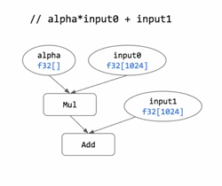
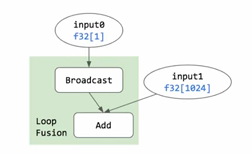

# XLA Broadcast
## broadcast
Broadcasting is the process of making arrays with different shapes have compatible shapes for arithmetic operations. The terminology is borrowed from Numpy (broadcasting).
### numpy broadcast
The term broadcasting describes how numpy treats arrays with different shapes during arithmetic operations. Subject to certain constraints, the smaller array is “broadcast” across the larger array so that they have compatible shapes. 

Broadcasting provides a means of vectorizing array operations so that looping occurs in C instead of Python. It does this without making needless copies of data and usually leads to efficient algorithm implementations. There are, however, cases where broadcasting is a bad idea because it leads to inefficient use of memory that slows computation.

NumPy operations are usually done on pairs of arrays on an element-by-element basis. In the simplest case, the two arrays must have exactly the same shape, as in the following example:
```python
>>> a = np.array([1.0, 2.0, 3.0])
>>> b = np.array([2.0, 2.0, 2.0])
>>> a * b
array([ 2.,  4.,  6.])
```
NumPy’s broadcasting rule relaxes this constraint when the arrays’ shapes meet certain constraints. The simplest broadcasting example occurs when an array and a scalar value are combined in an operation:
```python
>>> a = np.array([1.0, 2.0, 3.0])
>>> b = 2.0
>>> a * b
array([ 2.,  4.,  6.])
```


### xla broadcast

Broadcasting may be required for operations between multi-dimensional arrays of different ranks, or between multi-dimensional arrays with different but compatible shapes. 

Consider the addition X+v where X is a matrix (an array of rank 2) and v is a vector (an array of rank 1). To perform element-wise addition, XLA needs to "broadcast" the vector v to the same rank as the matrix X, by replicating v a certain number of times. The vector's length has to match at least one of the dimensions of the matrix.

For example:
```
|1 2 3| + |7 8 9|
|4 5 6|
```
The matrix's dimensions are (2,3), the vector's are (3). The vector is broadcast by replicating it over rows to get:
```
|1 2 3| + |7 8 9| = |8  10 12|
|4 5 6|   |7 8 9|   |11 13 15|
```
## Principles

XLA is a low-level infrastructure with a XLA language this is as strict and explicit as possible, avoiding implicit and "magical" features that may make some computations slightly easier to define, at the cost of more assumptions baked into user code that will be difficult to change in the long term. If necessary, implicit and magical features can be added in client-level wrappers.

In regards to broadcasting, explicit broadcasting specifications on operations between arrays of different ranks is required. This is different from Numpy, which infers the specification when possible.

## Broadcast composition

### Broadcasting a lower-rank array onto a higher-rank array

Most broadcasting needs can be captured by using a tuple of dimensions on a binary operation. When the inputs to the operation have different ranks, this broadcasting tuple specifies which dimension(s) in the higher-rank array to match with the lower-rank array.
```
|1 2 3| + 7 = |8  9  10|
|4 5 6|       |11 12 13|
```


### Broadcasting similar-rank arrays with degenerate dimensions
A related broadcasting problem is broadcasting two arrays that have the same rank but different dimension sizes. Similarly to Numpy's rules, this is only possible when the arrays are compatible. Two arrays are compatible when all their dimensions are compatible. Two dimensions are compatible if:

    They are equal, or
    One of them is 1 (a "degenerate" dimension)

When two compatible arrays are encountered, the result shape has the maximum among the two inputs at every dimension index.

Examples:

* (2,1) and (2,3) broadcast to (2,3).
* (1,2,5) and (7,2,5) broadcast to (7,2,5)
* (7,2,5) and (7,1,5) broadcast to (7,2,5)
* (7,2,5) and (7,2,6) are incompatible and cannot be broadcast.


### Broadcasting with both method

Broadcasting of a lower-rank array to a higher-rank array and broadcasting using degenerate dimensions can both be performed in the same binary operation. For example, a vector of size 4 and an matrix of size 1x2 can be added together using broadcast dimensions value of (0):
```
|1 2 3 4| + [5 6]    // [5 6] is a 1x2 matrix, not a vector.
```
```
|1 1| + [5 6]
|2 2|
|3 3|
|4 4|
```
```
|1 1| + |5 6|     |6  7|
|2 2| + |5 6|  =  |7  8|
|3 3| + |5 6|     |8  9|
|4 4| + |5 6|     |9 10|
```
## Loop Fusion with broadcast
Optimization can be done with XLA broadcast.

a loop fusion example:



```cpp
__global__ Fusion(float* input0, float* input1, float* output)
{
    int i = blockIdx.x * blockDIm.x + threadIDx.x;
    if (i < 1024)
    {
        output[i] = *input0 + input1[i];
    }
}

__global__ void Mul(float* alpha, float* input0, float* mul_result)
{
    int i = blockIdx.x * blockDim.x + threadIdx.x;
    if (i < 1024)
    {
        mul_result[i] = *alpha * input0[i];
    }
}

__global__ void Add(float* mul_result, float* input1, float* output)
{
    int i = blockIdx.x * blockDim.x + threadIdx.x;
    if (i < 1024)
    {
        mul_result[i] = mul_result[i] * input1[i];
    }
}
```




```python
# op1
for each output index I:
    output[I] = f1(input[g1(I)])

# op2
for each output index I:
    output[I] = f2(input[g2(I)])
```

after using broadcast

```python
# op2·op1
for each output index I:
    output[I] = (f2·f1)(input[(g1·g2)(I)])
```