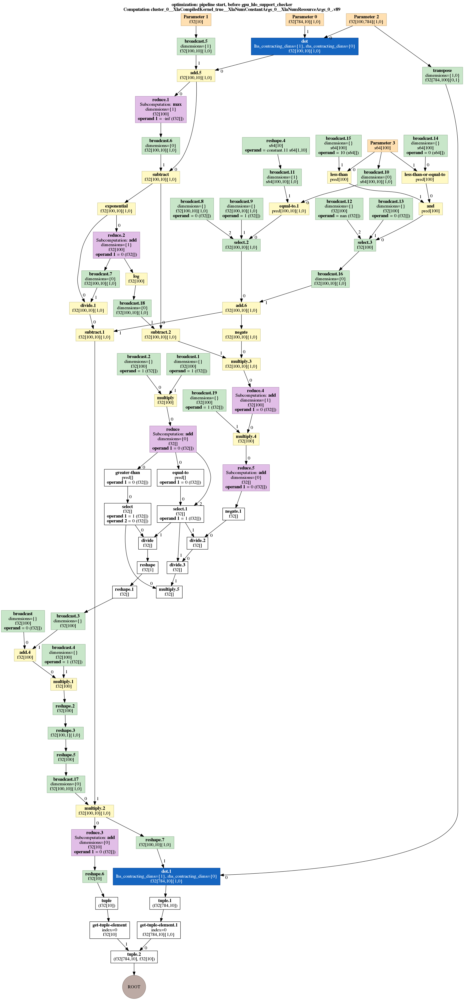
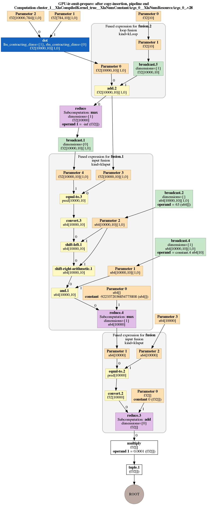

# XLA JIT Benchmark

We executed a sample script `mnist_softmax_xla.py` to test XLA with JIT at session level. Note that this only supports GPU.

Inside this script, JIT was turned on via these codes.

```python
config = tf.ConfigProto()
  jit_level = 0
  if FLAGS.xla:
    # Turns on XLA JIT compilation.
    jit_level = tf.OptimizerOptions.ON_1

  config.graph_options.optimizer_options.global_jit_level = jit_level
```

## Run without XLA

Execute the script to train the model without XLA.

```shell
python 3.6 mnist_softmax_xla.py --xla=''
```

An timeline file `timeline.ctf.json` (see `BenchmarkAndTests/no_xla.json`) will be created at current directory. Use `chrome://tracing` to visualize it.


We can see each operation on GPU such as MatMul for multiply matrixs.

## Run with XLA

By adding XLA debug flags we can generate XLA HLO graph.

```shell
TF_XLA_FLAGS="--xla_generate_hlo_graph=.* --xla_hlo_graph_path=/home/blealtancao/tensorflow/dots" python3.6 mnist_softmax_xla.py
```

Another timeline file was generated (see `BenchmarkAndTests/xla.json`). 


Compare this to timeline without xla, all primary computation was concluded into `_XlaLaunch`. The execution time reduced from 1.675ms to 1.218ms(note that this is not the total time but the duration of each round). If we compare the actual computation time, the time reduces from 1.098ms to 0.625ms.

During the process, some `.dot` file was created inside the specified directory, which contains informations about the graphs created by XLA(see folder `BenchmarkAndTests/dots`). By reviewing `.dot` files from No.0 to No.85, the process that XLA takes to fuse Ops can be noticed.

`hlo_graph_0.dot`:

`hlo_graph_85.dot`:



We can see that operations in the final result is much less than the origin input graph. At the head of each `.dot` file, there are optimizations or simplifications that XLA did.

Inside the final dot file, each subgraph means that XLA fused multiple operators(kernel fusion) into a small number of compiled kernels, which is the main benefit of XLA with JIT. This helps reduce memory bandwidth requirements and improve performance compared to executing operators one-at-a-time, as TensorFlow executor does.