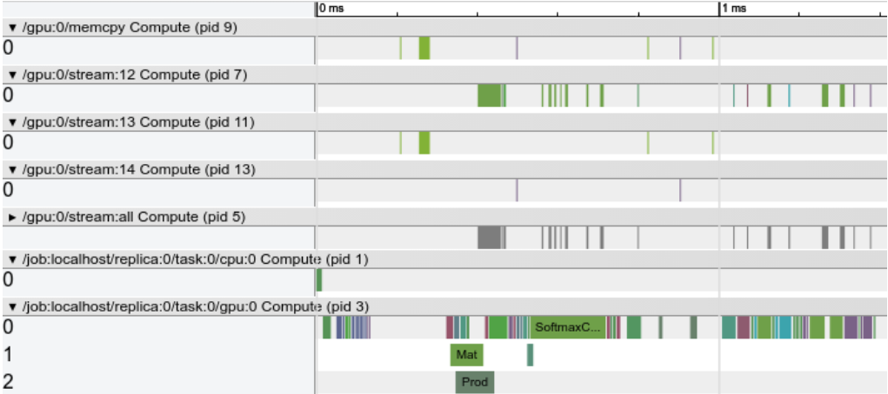
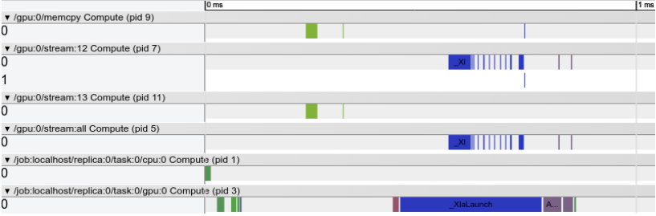

# Rough Test

To include XLA to TensorFlow, we must compile TensorFlow from source.

## Include XLA with JIT Compilation 

The TensorFlow/XLA JIT compiler compiles and runs parts of TensorFlow graphs via XLA. The benefit of this over the standard TensorFlow implementation is that XLA can fuse multiple operators (kernel fusion) into a small number of compiled kernels. Fusing operators can reduce memory bandwidth requirements and improve performance compared to executing operators one-at-a-time, as the TensorFlow executor does.

The following python code can turn on JIT in Tensorflow.

```python
# Config to turn on JIT compilation
config = tf.ConfigProto()
config.graph_options.optimizer_options.global_jit_level = tf.OptimizerOptions.ON_1

sess = tf.Session(config=config)
```

## Placing operators on XLA

Another way to run computations via XLA is to place an operator on a specific XLA device. This method is normally only used for testing. Valid targets are `XLA_CPU` or `XLA_GPU`.

```python
with tf.device("/job:localhost/replica:0/task:0/device:XLA_GPU:0"):
  output = tf.add(input1, input2)
```

Unlike JIT compilation on the standard CPU and GPU devices, these devices make a copy of data when it is transferred on and off the device. The extra copy makes it expensive to mix XLA and TensorFlow operators in the same graph.

## XLA Rough Test and Profiling

We will use  CUDA Profiling Tools Interface [(CUPTI)](http://docs.nvidia.com/cuda/cupti/index.html) to do GPU profiling. TensorFlow uses CUPTI to pull tracing information from the GPU.

We use this example python code to do the first test.

```python
from __future__ import absolute_import
from __future__ import division
from __future__ import print_function

import argparse
import sys

import tensorflow as tf

from tensorflow.examples.tutorials.mnist import input_data
from tensorflow.python.client import timeline

FLAGS = None


def main(_):
  # Import data
  mnist = input_data.read_data_sets(FLAGS.data_dir)

  # Create the model
  x = tf.placeholder(tf.float32, [None, 784])
  w = tf.Variable(tf.zeros([784, 10]))
  b = tf.Variable(tf.zeros([10]))
  y = tf.matmul(x, w) + b

  # Define loss and optimizer
  y_ = tf.placeholder(tf.int64, [None])

  # The raw formulation of cross-entropy,
  #
  #   tf.reduce_mean(-tf.reduce_sum(y_ * tf.log(tf.nn.softmax(y)),
  #                                 reduction_indices=[1]))
  #
  # can be numerically unstable.
  #
  # So here we use tf.losses.sparse_softmax_cross_entropy on the raw
  # logit outputs of 'y', and then average across the batch.
  cross_entropy = tf.losses.sparse_softmax_cross_entropy(labels=y_, logits=y)
  train_step = tf.train.GradientDescentOptimizer(0.5).minimize(cross_entropy)

  config = tf.ConfigProto()
  jit_level = 0
  if FLAGS.xla:
    # Turns on XLA JIT compilation.
    jit_level = tf.OptimizerOptions.ON_1

  config.graph_options.optimizer_options.global_jit_level = jit_level
  run_metadata = tf.RunMetadata()
  sess = tf.Session(config=config)
  tf.global_variables_initializer().run(session=sess)
  # Train
  train_loops = 1000
  for i in range(train_loops):
    batch_xs, batch_ys = mnist.train.next_batch(100)

    # Create a timeline for the last loop and export to json to view with
    # chrome://tracing/.
    if i == train_loops - 1:
      sess.run(train_step,
               feed_dict={x: batch_xs,
                          y_: batch_ys},
               options=tf.RunOptions(trace_level=tf.RunOptions.FULL_TRACE),
               run_metadata=run_metadata)
      trace = timeline.Timeline(step_stats=run_metadata.step_stats)
      with open('timeline.ctf.json', 'w') as trace_file:
        trace_file.write(trace.generate_chrome_trace_format())
    else:
      sess.run(train_step, feed_dict={x: batch_xs, y_: batch_ys})

  # Test trained model
  correct_prediction = tf.equal(tf.argmax(y, 1), y_)
  accuracy = tf.reduce_mean(tf.cast(correct_prediction, tf.float32))
  print(sess.run(accuracy,
                 feed_dict={x: mnist.test.images,
                            y_: mnist.test.labels}))
  sess.close()


if __name__ == '__main__':
  parser = argparse.ArgumentParser()
  parser.add_argument(
      '--data_dir',
      type=str,
      default='/tmp/tensorflow/mnist/input_data',
      help='Directory for storing input data')
  parser.add_argument(
      '--xla', type=bool, default=True, help='Turn xla via JIT on')
  FLAGS, unparsed = parser.parse_known_args()
  tf.app.run(main=main, argv=[sys.argv[0]] + unparsed)
```

Without XLA, we execute the python script to train the model.

```
python mnist_softmax_xla.py --xla=''
```

Using the Chrome Trace Event Profiler (browse to chrome://tracing), open the timeline file created when the script finishes: `timeline.ctf.json`. The rendered timeline should look similar to the picture below with multiple green boxes labeled `MatMul`, possibly across multiple CPUs.



Execute the python script to train the model with XLA and turn on a debugging feature of XLA via an environmental variable that outputs the XLA graph.

```
TF_XLA_FLAGS=--xla_generate_hlo_graph=.* python mnist_softmax_xla.py
```

Open the timeline file created (`timeline.ctf.json`). The rendered timeline should look similar to the picture below with one long bar labeled `_XlaLaunch`.



